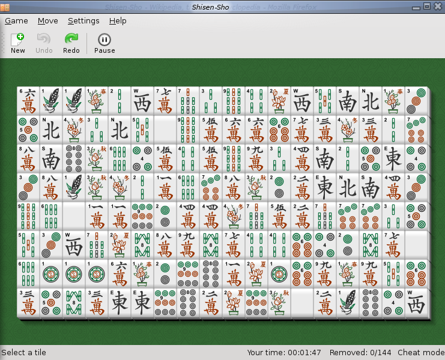
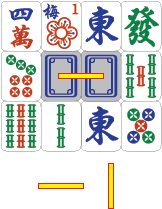
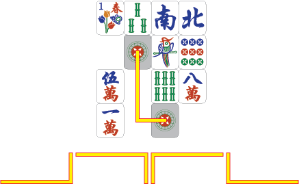
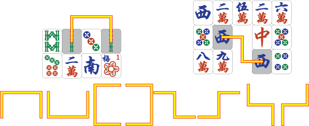

# Jeu de couplage

Dans ce problème, nous allons utiliser ``fltk`` pour coder un petit jeu de couplage surnommé _Shisen-Sho_, qui est une variante du fameux jeu Shanghai (solitaire de Mahjong). Voici une image (tirée de [Wikipedia](https://en.wikipedia.org/wiki/File:Shisen-Sho.png)) d'un tel jeu sur KDE.

## Description du jeu

Le jeu se déroule sur une grille 8×12 remplie de tuiles, dont chacune a un type (illustré par une petite image). Le but du jeu est d'éliminer toutes les tuiles (ou au moins le plus possible) en couplant des paires de tuiles du même type (donc avec la même image). Cependant, il y a une restriction pour le couplage à chaque étape : les deux tuiles couplées doivent être reliées par un chemin sans d'autre tuiles au milieu et qui fait au plus deux virages.

Un *chemin* sur la grille entre deux tuiles est valide si et seulement si les conditions suivantes sont vérifiées :

1. Les deux tuiles aux extrémités sont du même type. Ces deux tuiles sont à éliminer.

2. Il n'y a aucune tuile sur le chemin, sauf aux deux extrémités (les deux tuiles à éliminer).

3. Il y a au plus deux virages sur le chemin, qui sont forcément de 90 degrés (dans le sens horaire ou antihoraire).

Voici quelques exemples de chemins valides (tous tirés de Wikipedia). Commençons par ceux sans virage :

Voici les exemples avec un virage :

Et on termine avec les exemples avec deux virages :

Attention, il est possible que le chemin ait une partie en dehors de la grille, et le chemin reste valide dans ce cas-là. Cependant, il est possible de prouver qu'un tel chemin ne s'éloigne jamais de la grille de plus d'une case.

Il est aussi possible que le chemin passe seulement par deux tuiles, c'est le cas lorsque deux tuiles identiques sont adjacentes.

Si vous êtes intéressé par d'autres informations de ce jeu, vous pouvez consulter [sa page Wikipedia](https://en.wikipedia.org/wiki/Shisen-Sho).

### Déroulement, fin de partie et calcul du score

En commençant par une grille aléatoire, à chaque étape, le joueur peut sélectionner deux tuiles en cliquant dessus l'une après l'autre. S'il y a un chemin valide entre les deux tuiles sélectionnées, alors elles sont éliminées toutes les deux.

Le joueur continue jusqu'à l'impossibilité de trouver un chemin valide. Dans ce cas, s'il n'y a plus de tuiles, c'est-à-dire tous les tuiles sont éliminées, alors le jeu continue avec une nouvelle grille aléatoire. Sinon, c'est-à-dire s'il y a des tuiles restantes mais pas de chemin valide, alors la partie se termine. Le score final du joueur est le nombre de paires de tuiles éliminées dans la partie.

## Partie obligatoire

Réaliser le jeu avec ``fltk``. La sélection des tuiles doit se fait avec le souris. L'utilisateur peut annuler la sélection en cliquant une deuxième fois. Dès que les deux tuiles sont sélectionné, s'il y a un chemin valide entre les deux, alors le programme doit afficher ce chemin avant de faire disparaître les tuiles. Sinon, les deux tuiles sont désélectionnées, et le joueur recommence. S'il n'y a plus de tuiles qu'on peut éliminer, le programme doit pouvoir détecter ce fait et terminer la partie.

Tous les paramètres de base du jeu (taille de la fenêtre, dimensions de la grille, images utilisées, etc.) doivent être faciles à changer en modifiant quelques lignes du code.

Pour les images, vous êtes fortement encouragés d'utiliser les ressources libres de droits (avec une licence open source ou Creative Commons), par exemple celles disponibles sur [OpenGameArt](https://opengameart.org/).

## Améliorations possibles

Voici quelques suggestions pour aller plus loin sur ce jeu. Cette liste est comme d'habitude non exhaustive, vous pouvez inventer vos propres améliorations. Attention, certaines des idées ci-dessous sont assez faciles à réaliser, d'autres sont nettement plus dures !

- Générer une grille initiale garantissant qu'il est possible d'éliminer toutes les tuiles.

- Ajouter un système de points pour le score final qui prend en compte le temps passé par l'utilisateur à trouver chaque chemin d'élimination valide.

- Donner quelques niveaux de difficulté en variant les paramètres suivants :

    + la taille de la grille,

    + le nombre de virages autorisés dans les chemins valides,

    + le nombre de types de tuiles distincts et le nombre de tuiles de chaque type.

- Ajouter des paramètres en ligne de commande, par exemple le niveau de difficulté, le thème de tuile, la taille de la fenêtre, etc. Il est fortement conseillé d'utiliser le module `argparse` pour traiter les paramètres.

- Enregistrer les meilleurs scores et les afficher (avec le nom du joueur) à la fin de chaque partie.

- Ajouter des animations pour l'élimination des tuiles.

- Au lieu d'une grille simple, faire des couches de tuiles comme dans le solitaire de Mahjong, avec une règle raisonnable pour traiter les tuiles dans deux couches différentes. Attention, les couches supérieures doivent cacher celles inférieures, donc toutes les tuiles ne seront pas disponibles au début du jeu.

- Ajouter une fonction "indice" qui met en évidence un coup possible.

- Donner automatiquement des indications si le joueur n'a pas agit pendant un certain temps.
